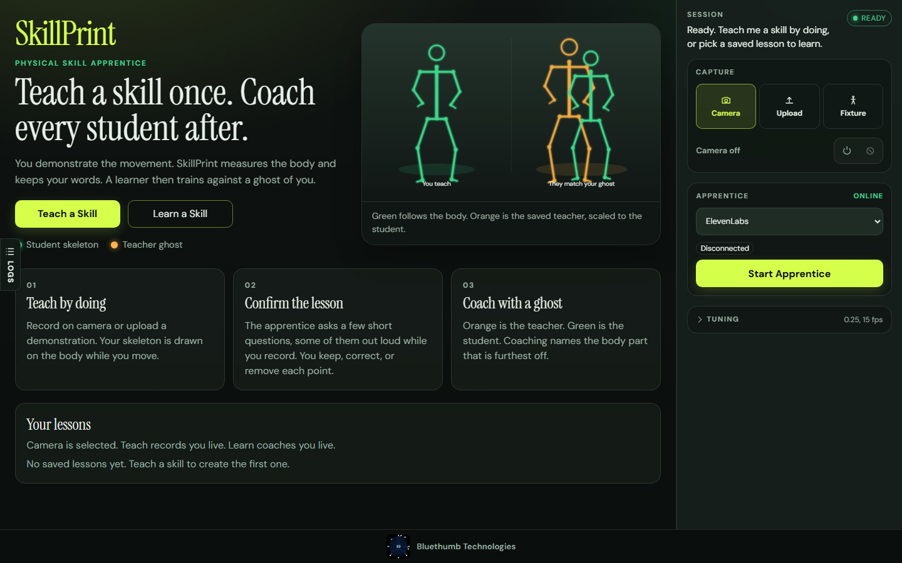
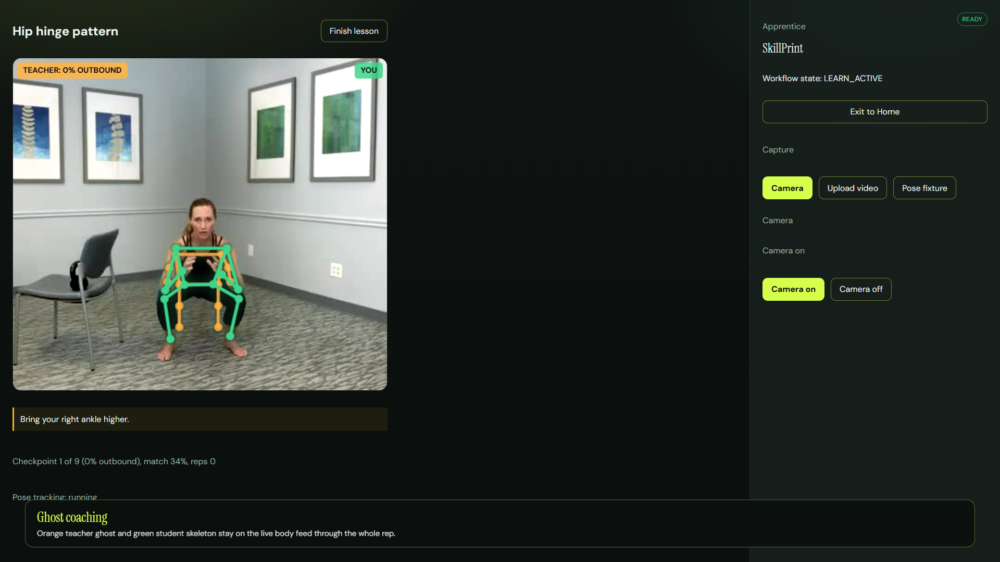
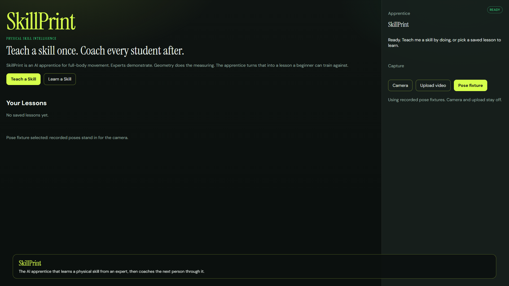

<p align="center">
  
</p>

# SkillPrint

> **Hosted App: [Open SkillPrint](https://skillprint.emranb.chatgpt.site)**
>
> Sign in with the owner's ChatGPT account. This deployment runs the browser/offline app; server sync and live ElevenLabs features require backend hosting.

**Teach a skill once. Coach every student after.**

An expert demonstrates a physical skill. SkillPrint measures the body, keeps the expert's words, and turns that into a lesson. The next person trains against a ghost of the teacher. Coaching names the joint that is off.

The engine does not invent technique. Geometry is measured in the app. Meaning comes from the expert.

<p align="center">
  
</p>

<p align="center"><em>Orange is the teacher ghost. Green is the student, drawn on the live body.</em></p>

## Watch

Two short films. Click a still to play.

<table>
  <tr>
    <td width="50%" valign="top">
      <a href="https://github.com/emranB/skill-print/blob/main/videos/skillprint-product.mp4">
        
      </a>
      <p><strong>Product</strong> · 36s · <a href="https://github.com/emranB/skill-print/blob/main/videos/skillprint-product.mp4">Play</a></p>
      <p>Home, naming a skill, reviewing reps, capture questions, teach-back, the lesson library, and ghost coaching.</p>
    </td>
    <td width="50%" valign="top">
      <a href="https://github.com/emranB/skill-print/blob/main/videos/skillprint-tech.mp4">
        
      </a>
      <p><strong>In the app</strong> · 36s · <a href="https://github.com/emranB/skill-print/blob/main/videos/skillprint-tech.mp4">Play</a></p>
      <p>Live navigation: teach a lesson, then learn with both skeletons on the camera feed.</p>
    </td>
  </tr>
</table>

Files also live in the repo: [videos/skillprint-product.mp4](videos/skillprint-product.mp4) and [videos/skillprint-tech.mp4](videos/skillprint-tech.mp4).

## How it works

1. **Teach by doing.** Record on camera or upload a demonstration. A skeleton with spine, head, hands, and feet is drawn on the body. Missing joints show in red.
2. **Confirm the lesson.** The apprentice asks only what was not already said or shown: why a shape matters, what to watch, what must never happen. During a live camera session those questions can be asked aloud. You keep, correct, or remove each point.
3. **Coach with a ghost.** The learner answers one prediction question, then moves. Orange is the saved teacher, scaled to the student. Green is the student. Cues name the body part that is furthest off.

A lesson is a named movement, not a hard-coded sport. Saved lessons are `lessons/<id>.json` at the project root, so a deploy that includes that folder opens with the library already loaded.

Screen-by-screen copy: [docs/PRODUCT.md](docs/PRODUCT.md). Demo path: [docs/DEMO_CHECKLIST.md](docs/DEMO_CHECKLIST.md).

## Run locally

Node 20+, current desktop Chrome or Chromium.

```
./run.sh
```

That stops leftover listeners on 5173 and 8000 (and stops Docker Compose if it is holding 8000), then starts `npm run dev`. Docker is a separate path.

```
cp .env.example .env
npm install
npm run dev
```

- UI: http://localhost:5173
- API: http://localhost:8000 (Vite proxies `/api`)

Put a real `ELEVENLABS_API_KEY` and the existing `ELEVENLABS_AGENT_ID` in `.env`. Do not use `VITE_` for secrets. The key must never appear in the browser bundle, DebugBus, logs, or git.

When those credentials are present, the apprentice defaults to ElevenLabs. Set `SKILLPRINT_APPRENTICE_DEFAULT=mock` to force the offline wording used by automated tests.

```
npm run typecheck
npm run test
npm run test:e2e
npm run verify
```

Full camera-and-agent suite (fake camera, real extraction): `npm run test:level-b`.

## Docker

```
docker compose build
docker compose up
```

http://localhost:8000. Other host port: `SKILLPRINT_HOST_PORT=8100 docker compose up`.

Rate limits per client address: `/api/apprentice/structured` 40/min, `/api/elevenlabs/session` 20/min, `/api/transcribe` 10/min. `TRUST_PROXY` only behind a reverse proxy.

## CI and Sites deployment

GitHub Actions runs type checks, lint, unit tests, and a production build on pushes and pull requests to `main`. Successful pushes upload the browser build and Sites hosting manifest as a `sites-browser-build` artifact.

**Automatic Sites deployment is not configured.** The available Sites integration provides short-lived source credentials and authenticated publishing tools, not a persistent CI deployment credential. Do not store a temporary Sites token in GitHub secrets. Until a supported CI publishing connection is available, publish through the Sites integration in Codex using the project in `.openai/hosting.json`.

## Architecture

- Source of truth: [docs/PROJECT_PLAN.md](docs/PROJECT_PLAN.md), [docs/DATA_CONTRACTS.md](docs/DATA_CONTRACTS.md), [docs/FILE_INDEX.md](docs/FILE_INDEX.md)
- Handoff: [docs/IMPLEMENTATION_STATUS.md](docs/IMPLEMENTATION_STATUS.md)
- Stack: TypeScript, React, Vite, Express, MediaPipe Pose, ElevenLabs, Zod, IndexedDB, Vitest, Playwright, Docker Compose

The apprentice uses the ElevenLabs agent configured in `.env`. The app does not run a local LLM.

<p align="center">
  <a href="https://bluethumbtechnologies.ca">
    
  </a>
</p>
