# PROJECT_PLAN.md

Primary source of truth for product behavior and architecture. Self-contained; do not depend on chat history.

Canonical persisted/runtime structures are defined in `docs/DATA_CONTRACTS.md` and are authoritative. Living execution state is in `docs/IMPLEMENTATION_STATUS.md`. Repository inventory is in `docs/FILE_INDEX.md`. Onboarding is in `README.md`.

---

## 1. Product purpose

SkillPrint is an AI Apprentice with no predefined skills. An expert teaches by demonstrating and explaining; SkillPrint converts the demonstration into a reusable lesson that can visually and verbally coach another person.

MVP visual domain: full-body physical motion.

Squat and push-up are the first two demonstrations proving the same engine works twice. The engine must never contain skill-specific branches such as `if skill === "squat"`, `detectSquat()`, or equivalent.

Core invariant: **Code measures geometry. The expert supplies meaning. AI connects the two.**

---

## 2. Locked MVP scope

In scope:
- Teach by live camera or uploaded video through one pipeline
- Learn from saved IndexedDB lessons with red teacher ghost / green student pose
- Generic cycle segmentation, canonical 9-checkpoint movement, sequential checkpoint tracking
- Continuous calibration; DebugBus; runtime config; Chrome/Chromium primary
- ElevenLabs transcription (Scribe) and voice agent after the zero-AI vertical slice works
- Deterministic Level C fixtures; genuine Level B MP4s when available

Out of scope for MVP:
- RAG, agents frameworks, SQL, vector DB, auth, queues, cloud lesson sync, microservices, nginx, Safari compatibility as a deadline blocker

---

## 3. UI layout and debug console

Persistent workspace. No conventional page navigation.

```
┌─────────────────────────────────────────┬───────────────────┐
│           VISUAL WORKSPACE (~75%)       │  APPRENTICE (~25%)│
│     camera / video / skeleton / UI      │  conversation     │
│                                         │  questions/status │
└─────────────────────────────────────────┴───────────────────┘
                    100vh
┌─────────────────────────────────────────────────────────────┐
│ DEBUG / LOGS (append-only; scroll below)                    │
└─────────────────────────────────────────────────────────────┘
```

- Both top columns are full viewport height.
- Debug console is append-only; workflow advances must not clear it.
- Refresh may clear transient workspace; submitted lessons persist in IndexedDB.
- Initial screen:

```
What would you like to do?

[ TEACH A SKILL ]     [ LEARN A SKILL ]

Your Lessons
────────────────────
Squat        [ Edit ]
Push-up      [ Edit ]
```

Apprentice shows Ready; debug records immediately (`APPLICATION_STARTED`, `CONFIG_LOADED`, `STORAGE_READY` when available). Saved lessons listed on HOME with Edit.

Debug developer controls (when `config.debug.enabled`):
- INPUT SOURCE: Live Camera | Upload Video | Pose Fixture
- APPRENTICE: ElevenLabs | Mock
- Runtime Configuration panel: in-memory overrides; log `CONFIG_CHANGED`; refresh restores `config.json`

---

## 4. Teach flow

1. HOME → Teach → device + body calibration (`CalibrationState` continuous monitor begins)
2. Skill setup: lesson name + optional important-things guidance (guidance, not truth; does not auto-create guardrails)
3. Optional metadata only if kept minimal later; scaling must come from measured body geometry, not required height
4. Move into skill natural start position → capture `skillReferencePose` / `referencePose` (distinct from body calibration)
5. Countdown → record synchronized session (SessionTimeMs): video, audio, pose, world landmarks, normalized pose, visibility, calibration events
6. End physical recording → review / re-record (retain old until replacement accepted). Capture is not finished yet.
7. Unified path: `TeachingMedia` → `analyzeTeachingSession`. Analyzer always returns `SessionAnalysis.poseRecording` (supplied or extracted). Caller may attach that recording onto `media.poseRecording`. `TeachingSession` has no separate pose field.
8. Cycle segmentation; later transcript (Scribe)
9. Teacher confirms good/bad/fragment/ignore (AI hypotheses non-authoritative)
10. **Capture Review** (still Capture): immediately after demonstration, with original visual context still available. Minimum 3 evidence-backed questions including ≥1 guardrail. Each Capture Review question has a required evidence clip.
11. Only after Capture Review completes, enter **Map / Debrief**: minimum 3 additional non-repeating follow-ups; teach-back; expert confirms or corrects before lesson compilation. Debrief clips are optional; do not invent timestamps.
12. Lesson review uses `LessonMap` (Work Map). Edit / Submit → IndexedDB Lesson

The physical demonstration itself is uninterrupted. Capture Review is the question stage inside Capture, not a phase outside Capture.

### 4a. Edit Lesson (saved lessons)

HOME → Edit on a saved lesson → `TEACH_EDITING`.

Edit Lesson can:
- rename lesson
- edit guidance
- change demonstration good/bad/fragment/ignore classification
- edit/re-answer learned knowledge
- edit/remove guardrails
- re-run analysis
- replace source recording

It is not a full timeline/video editor. Meaningful edits recompile the canonical lesson.

### 4b. Capture vs Map

```
CAPTURE
  demonstration (uninterrupted motion)
  → Capture Review (immediately afterward; visual context still available)

MAP
  → deeper debrief + teach-back
```

Capture Review stays inside Capture. Map/Debrief begins only after Capture Review completes.

---

## 5. Learn flow

1. HOME → Learn → lesson library (or select from HOME lessons)
2. Select lesson → student device + body calibration
3. Match lesson `referencePose` (red ghost at student scale) → START POSITION ✓
4. Before or during the first coached attempt, the Apprentice asks at least one prediction question grounded in learned expert knowledge (what the learner expects to matter at an upcoming checkpoint). Do not hardcode wording or movement semantics. Record the learner response for the mastery/practice report where practical.
5. Live student pose (green) vs teacher checkpoints (red)
6. Sequential CheckpointTracker: `0 → 25 → 50 → 75 → 100 → 75 → 50 → 25 → 0`
7. Similarity in normalized geometry + leniency; tracking validity independent of leniency
8. Continuous `CalibrationState`; lost required landmarks pause dependent scoring
9. After Gate 11: rate-limited voice coaching from deterministic mismatch events via ElevenLabs `sendContextualUpdate` (logged on DebugBus). Before ElevenLabs voice starts, CameraManager releases its audio track if no longer needed; video may continue.
10. REP_SUCCESS → brief overlay → reset expected checkpoint to 0 → may repeat
11. Finish Lesson always available: ends ElevenLabs conversation, stops application capture via CameraManager (and coordinates SDK mic teardown), shows `MasteryReport` (`LEARN_COMPLETE`). Completing a rep does not finish the lesson.

### 5a. Mastery report (`LEARN_COMPLETE`)

Component: `src/learn/MasteryReport.tsx`

After Finish Lesson, show a simple practice report, for example:

```
Squat: Practice Report

Successful repetitions: 4
Corrections given: 3

Most common issue:
Depth at 75-100%

Guardrails triggered:
1

[ Done ]
```

Done returns HOME (or library).

---

## 6. Data flow

```mermaid
flowchart LR
  mediaAdapters[LiveOrUploadAdapters] --> teachingMedia[TeachingMedia]
  teachingMedia --> analyzeSession[analyzeTeachingSession]
  analyzeSession --> geometry[DeterministicGeometry]
  geometry --> observations[NeutralObservations]
  observations --> aiMeaning[AIMeaningAndQuestions]
  aiMeaning --> lesson[CompiledLesson]
  lesson --> student[NormalizedComparePlusGhost]
```



```
SKILLPRINT
  ├── TEACH
  │     calibration → setup → skill start pose → TeachingMedia
  │     → analyzeTeachingSession → cycles → (AI questions) → Lesson → IndexedDB
  └── LEARN
        select → calibrate → match referencePose → checkpoints → REP_SUCCESS
        → Finish → release media
```

Unified media (all three converge on TeachingMedia, then the same entrypoint):

```
LiveMediaSource ───────► TeachingMedia(video + poseRecording)
UploadedMediaSource ───► TeachingMedia(video)
ReplayMediaSource ─────► TeachingMedia(poseRecording)
                              │
                              ▼
                    analyzeTeachingSession()
```

`ReplayMediaSource` builds fixture TeachingMedia. Do not route fixture replay around this entrypoint.

Inside `analyzeTeachingSession`: use `media.poseRecording` if present; else extract poses from `media.video`; else invalid. Zod requires at least one of video or poseRecording.

Never create `analyzeLiveRecording`, `analyzeUploadedRecording`, or `analyzeCameraVideo`.

---

## 7. Application state machine

States (`AppState` in `docs/DATA_CONTRACTS.md`). AI never arbitrarily changes state. `AppMachine` owns transitions.

Primary transitions:
- HOME → TEACH_CALIBRATION | LEARN_LIBRARY | TEACH_EDITING | ERROR
- TEACH_CALIBRATION → TEACH_SETUP | HOME | ERROR
- TEACH_SETUP → TEACH_READY | HOME | ERROR
- TEACH_READY → TEACH_RECORDING | HOME | ERROR
- TEACH_RECORDING → TEACH_RECORDING_REVIEW | ERROR
- TEACH_RECORDING_REVIEW → TEACH_RECORDING | TEACH_ANALYZING | HOME | ERROR
- TEACH_ANALYZING → TEACH_QUESTIONS | TEACH_LESSON_REVIEW | ERROR
- TEACH_QUESTIONS → TEACH_LESSON_REVIEW | ERROR
- TEACH_LESSON_REVIEW → TEACH_EDITING | TEACH_COMPLETE | HOME | ERROR
- TEACH_EDITING → TEACH_LESSON_REVIEW | TEACH_ANALYZING | HOME | ERROR
- TEACH_COMPLETE → HOME | LEARN_LIBRARY | ERROR
- LEARN_LIBRARY → LEARN_CALIBRATION | HOME | ERROR
- LEARN_CALIBRATION → LEARN_START_POSITION | HOME | ERROR
- LEARN_START_POSITION → LEARN_ACTIVE | HOME | ERROR
- LEARN_ACTIVE → LEARN_SUCCESS | LEARN_COMPLETE | HOME | ERROR
- LEARN_SUCCESS → LEARN_ACTIVE | LEARN_COMPLETE | ERROR
- LEARN_COMPLETE → HOME | LEARN_LIBRARY | ERROR
- ERROR → HOME

`HOME → TEACH_EDITING` is used when a saved lesson Edit button is clicked.

---

## 8. Architecture boundaries

| Area | Ownership |
|------|-----------|
| `app/` | Top-level state machine |
| `clock/` | SessionTimeMs, RealSessionClock, FakeSessionClock |
| `calibration/` | Device/body trust; continuous monitor |
| `media/` | TeachingMedia adapters; CameraManager owns streams |
| `pose/` | Deterministic geometry; no skill names |
| `teach/` | Expert capture UX |
| `analyze/` | Sole `analyzeTeachingSession` + neutral observations |
| `apprentice/` | AI behind ApprenticeGateway (ElevenLabs / Mock) |
| `review/` | Teacher Q&A and debrief |
| `lesson/` | Compile reusable Lesson |
| `learn/` | Student coaching and checkpoints |
| `storage/` | IndexedDB only for lessons/sessions |
| `config/` | Load defaults + runtime overrides |
| `debug/` | DebugBus and console |
| `components/` | Presentation only |
| `src/backend/` | Secrets + API proxy only; no pose/business logic |
| `utils/time.ts` | Presentation/duration formatting only |

Server routes only:
- `GET /api/health`
- `GET /api/config`
- `POST /api/transcribe`
- `POST /api/elevenlabs/session`

---

## 9. Non-negotiable invariants

1. Code measures geometry; expert supplies meaning; AI connects them.
2. Zero squat/push-up-specific engine logic. Never branch on skill name, lesson name, fixture name, or filenames.
3. Never ask an LLM to calculate geometry that can be computed deterministically.
4. Live and upload converge to `TeachingMedia` then only `SessionAnalyzer.analyzeTeachingSession`.
5. AI never mutates app state. Path: AI proposal → Zod validation → deterministic application. Invalid AI output: log, no mutation, may retry, may fall back to Mock/manual.
6. Every meaningful learned fact retains provenance (`docs/DATA_CONTRACTS.md`).
7. In-session correlation uses `SessionTimeMs`; pre-session events use `wallTimeIso` and may omit `sessionTimeMs`.
8. Calibration remains continuously active via `CalibrationState` (`valid` | `degraded` | `lost` per camera/microphone/fullBody/bodyScale/landmark). Individual recovery; no global restart.
9. Missing/invalid tracking never counts as movement success, regardless of leniency (including leniency = 1).
10. High-frequency pose arrays stay outside React render state.
11. Runtime behavior must be replayable from Level C fixture data.
12. No secret credentials in browser code (`VITE_ELEVENLABS_*` forbidden).
13. No unnecessary infrastructure (RAG, agents frameworks, SQL, vector DB, auth, queues, cloud state).
14. Body calibration ≠ skill reference/start pose.
15. CheckpointTracker is sequential; closest-pose jumping is forbidden.
16. Binary MP4 and MediaPipe `.task` assets must be genuine when required; never empty placeholders.
17. CameraManager owns application capture media; ElevenLabs may own SDK mic only while a voice session is active (see Media ownership).
18. `TeachingMedia` must include at least video or poseRecording; `analyzeTeachingSession` is the sole analysis entrypoint for all sources.

---

## 10. Media ownership

CameraManager is the sole owner of **application capture media**.

It owns:
- teaching camera video
- teaching-recording microphone audio
- student camera video
- calibration audio/video

**Exception: ElevenLabs voice sessions:** The ElevenLabs React SDK `startSession()` for voice conversations manages its own microphone / WebRTC input. ElevenLabs may own its SDK-managed microphone track while an ElevenLabs voice conversation is active.

Lifecycle:
- Before ElevenLabs voice starts, release/stop the CameraManager audio track if it is no longer needed. CameraManager may continue owning the video track.
- No other module may independently call `getUserMedia()`.
- Text-only ElevenLabs sessions (no mic) are allowed for analysis, but the demo voice-apprentice path uses voice sessions with the exception above.

Typical phases:
- Teach recording: CameraManager video+audio
- Voice review: CameraManager audio stopped; video optional; ElevenLabs mic active
- Student calibration: CameraManager video+audio
- Active lesson coaching: CameraManager video; audio stopped; ElevenLabs mic active

CameraManager must release all owned tracks on: Finish Lesson, abandoned calibration, session replacement, application teardown, explicit media reset (plus `releaseAudio()` when handing mic to ElevenLabs).

VideoRecorder consumes CameraManager streams but does not own or stop them.
MicrophoneCalibration consumes CameraManager-provided audio (not ElevenLabs).

MediaRecorder MIME fallback (first supported): `video/webm;codecs=vp9,opus` → `vp8,opus` → `video/webm`.

---

## 11. SessionTimeMs

Milliseconds from the monotonic start of the active Teach or Learn session.

| Source | Mapping |
|--------|---------|
| Live teach/learn | `performance.now() - activeSessionStartMonotonic` |
| Uploaded video | `video.currentTime * 1000` |
| Pose fixture replay | fixture `timestampMs` via FakeSessionClock |

Downstream code must not care which source produced the timeline.

Used for: pose frames, transcript words, video positions, cycles, questions, clips, in-session debug events, knowledge provenance.

Do not invent fake session-relative timestamps before a session exists.
Do not require a persisted LearningSession artifact solely for this clock; runtime learn context may use SessionClock without persistence.

`src/clock/*` owns session time. `src/utils/time.ts` owns presentation formatting only.

---

## 12. Calibration model

Three jobs:
1. **Device**: camera permission/frames; microphone permission/level; speech recognition (stub/mock until Gate 8); pose model available
2. **Body**: expected landmarks visible; person in frame; stable body scale (shoulder width, torso length, hip width, span); landmark visibility confidence → persisted as `BodyCalibration`
3. **Continuous**: every live frame updates `CalibrationState` metrics independently (`camera`, `microphone`, `fullBody`, `bodyScale`, per-landmark entries) each `valid` | `degraded` | `lost`

Grace period from config (`calibration.lostTrackingMs`). Momentary loss continues; prolonged loss prompts recovery for that metric only; resume without global restart.

Example: left ankle lost while body scale/camera/microphone remain valid → recover left ankle only.

Audio calibration example: phrase such as "blue river seven" with fuzzy match through transcription path (stub until Gate 8).

Required tracking profile on Lesson prioritizes landmarks/features that matter for that lesson.

---

## 13. Skill reference pose

Body calibration establishes scale and visibility.
After Skill Setup, teacher moves into the skill natural start position; a short stable interval establishes `skillReferencePose` / `referencePose`.
Standing vs plank-like starts are not encoded as skill-specific logic; they come from demonstration.

Student: body calibrate → load `referencePose` → render at student scale → match start → then trajectory progression.

---

## 14. Pose extraction, normalization, backpressure

MediaPipe Pose Landmarker via `@mediapipe/tasks-vision` (~12-20 samples/s, config `sampleFps` default 15). Throttled on main thread initially; interface allows later workerization.

`public/models/pose_landmarker_full.task` must be a genuine usable model. Never create zero-byte/fake placeholders. Gate 2 complete only when real browser init succeeds, or temporary external model URL is documented with local asset incomplete in `docs/IMPLEMENTATION_STATUS.md`. Preferred: local asset.

Normalization: origin ≈ hip midpoint; scale from stable body dimensions; compare joint angles, relative vectors, normalized distances, torso orientation in normalized space. Teacher ghost mapped onto student scale. Raw pixel overlap is not the primary success metric.

Backpressure: if PoseDetector busy, skip next inference candidate and emit `POSE_FRAME_SKIPPED`. No unbounded queue. Camera may be ~30 FPS; pose sampling ~15 FPS.

---

## 15. Generic cycle segmentation and apex

Reference = initial stable skill pose.
NEAR_REFERENCE → ACTIVE (distance above threshold) → APEX (max excursion) → RETURNING → CANDIDATE_CYCLE (near reference for stable interval).

Apex = frame of maximum normalized pose distance from start; not the end of the repetition. Sequence intent: leave start → max excursion (100) → return to start (0).

Detected cycles start as `unknown`. AI may hypothesize good/bad/fragment; teacher confirmation is authoritative. Partial/bad examples are not automatically assumed good.

---

## 16. Canonical movement (9 checkpoints)

Confirmed good cycles split at apex. Normalize outbound and return independently. Sample:

Outbound: 0, 25, 50, 75, 100  
Return: 75, 50, 25, 0  

Median pose geometry across good examples → nine checkpoints. Outbound and return may differ. UI labels: `0 → 25 → 50 → 75 → 100 → 75 → 50 → 25 → 0`.

Feature weights conceptually inverse to variance across good demos (clamped); expert-confirmed relationships may add weight. Remains generic.

---

## 17. Similarity and leniency

Per checkpoint: major joint angle diffs, normalized landmark displacement, relative geometry, visibility mask, learned weights → error → similarity ∈ [0,1].

Single top-level parameter `leniency` ∈ [0,1]; roughly `requiredSimilarity = 1 - leniency`. Editable at runtime via debug config; does not rewrite `config.json` until refresh restores file defaults.

Tracking validity is independent. Leniency = 1 cannot make missing/invalid tracking succeed. Checkpoint skipping cannot count as success.

Checkpoints are tolerance regions passed through (`checkpointHoldMs`), not freezes.

---

## 18. Provenance

Every KnowledgeItem and Guardrail must retain provenance so lesson review can answer "Why does SkillPrint believe this?" See `docs/DATA_CONTRACTS.md`.

`src/lesson/LessonMap.tsx` is the clickable Work Map. It presents:
- ordered movement checkpoints/steps
- expert knowledge
- reasons
- guardrails
- linked evidence moments

Selecting an evidence item replays the associated expert clip/moment. No extra architecture layer.

---

## 19. AI boundaries and ElevenLabs

AI may: interpret meaning, generate clarification questions, debrief, coach verbally.

AI must not: calculate deterministic geometry, mutate app state, decide missing tracking is acceptable, bypass Zod validation.

Abstraction:
- `ApprenticeGateway` interface
- Production: `ElevenLabsGateway`
- Tests/debug: `MockApprenticeGateway`

ElevenLabs:
- Scribe v2 transcription with word-level timestamps as SessionTimeMs (server-side; API key never in Vite client)
- Agent for analysis/review/coach; text-only analysis allowed
- Coaching: send deterministic mismatch/context via `sendContextualUpdate()`; DebugBus logs full request/result; DebugBus is not the destination
- Capture (demonstration, then Capture Review still inside Capture): minimum 3 evidence-backed questions; at least 1 guardrail; each Capture Review question has a required evidence clip
- Map/Debrief (only after Capture Review): minimum 3 additional non-repeating follow-ups; teach-back; expert confirm/correct before compile; clip timestamps optional
- Learn: at least one prediction question before or during the first coached attempt, grounded in expert knowledge
- 3-second evidence clips: store source video + clipStartMs/clipEndMs; MomentPlayer seeks/pauses; overlay pose

Questions / coaching rate limits from config (`review.*`, `coaching.*`). `maximumQuestions` may cap Capture Review; minimums above still apply for demo acceptance when AI path is enabled.

---

## 20. Secrets and DebugBus

Env (server only):
```
ELEVENLABS_API_KEY=
ELEVENLABS_AGENT_ID=
PORT=8000
```

Never `VITE_ELEVENLABS_*`.

All observability through DebugBus (`DebugEvent` in `docs/DATA_CONTRACTS.md`).

Must redact: API keys, authorization headers, reusable signed session secrets/tokens, cookies/session credentials, other credentials.

May log: prompts, model I/O, structured rationale/evidence/confidence, provider debug callbacks, tool calls/results, pose summaries, config, calibration, segmentation, student matching, errors, performance.

Do not invent inaccessible hidden LLM chain-of-thought.
High-frequency full landmark arrays stay in session data; console shows summaries + expandable payloads.
Provide copy visible log / copy full debug trace (redacted).

---

## 21. Runtime configuration defaults

Create as root `config.json` at Gate 1 exactly:

```json
{
  "schemaVersion": 1,
  "pose": {
    "leniency": 0.25,
    "minimumVisibility": 0.65,
    "sampleFps": 15,
    "checkpointHoldMs": 150
  },
  "calibration": {
    "lostTrackingMs": 1000
  },
  "review": {
    "clipBeforeMs": 1500,
    "clipAfterMs": 1500,
    "maximumQuestions": 6
  },
  "coaching": {
    "mismatchPersistenceMs": 500,
    "minimumPromptIntervalMs": 2500
  },
  "debug": {
    "enabled": true
  }
}
```

Runtime edits are in-memory overrides only until refresh.

---

## 22. Persistence

IndexedDB: Lesson, TeachingMedia (includes pose recording; `schemaVersion`), Transcript (`schemaVersion`), question answers, evidence timestamps, AnalysisRun (all versioned with `schemaVersion`). No second pose recording field beside `media`.

localStorage: tiny UI preferences only.

Submitted lessons survive refresh. Transient workspace may clear on refresh.

---

## 23. Technology stack

| Area | Choice |
|------|--------|
| Client | TypeScript, React, Vite, plain CSS |
| Pose | `@mediapipe/tasks-vision` |
| Voice | `@elevenlabs/react` / ElevenAgents |
| Transcription | ElevenLabs Scribe v2 |
| Validation | Zod 4 |
| Capture | MediaRecorder, MediaDevices, Canvas |
| Persistence | IndexedDB |
| Server | Node.js + Express |
| Unit tests | Vitest |
| E2E | Playwright (Chrome) |
| Container | Docker + Compose, one service |

IDs: `crypto.randomUUID()`.

Primary browser: current desktop Chrome/Chromium.

---

## 24. Ports and Docker

Local development:
- Vite client: 5173 (unless unavailable); proxies `/api` to Express on 8000
- Express: `PORT` from `.env`, default 8000

Production Docker:
- One Node container serves API + built React assets
- Same Express `PORT=8000`; compose maps host 8000 → container 8000
- No nginx required

Commands (planned until Gate 1 implements them): `docker compose build`, `docker compose up` → `http://localhost:8000`

---

## 25. Repository tree

Plain filenames only. No Markdown hyperlinks for local paths. No escaped filename dots.

```
skillprint/
│
├── README.md
├── docs/
│   ├── PROJECT_PLAN.md
│   ├── DATA_CONTRACTS.md
│   ├── FILE_INDEX.md
│   └── IMPLEMENTATION_STATUS.md
├── config.json
├── package.json
├── package-lock.json
├── tsconfig.json
├── tsconfig.server.json
├── vite.config.ts
├── vitest.config.ts
├── playwright.config.ts
├── eslint.config.js
├── .prettierrc
├── .gitignore
├── .dockerignore
├── .env.example
│
├── Dockerfile
├── docker-compose.yml
│
├── public/
│   └── models/
│       └── pose_landmarker_full.task
│
├── fixtures/
│   ├── motion-cycle-a/
│   │   ├── teacher.pose.json
│   │   ├── student-good.pose.json
│   │   ├── student-bad.pose.json
│   │   └── expected.json
│   ├── motion-cycle-b/
│   │   ├── teacher.pose.json
│   │   ├── student-good.pose.json
│   │   ├── student-bad.pose.json
│   │   └── expected.json
│   ├── squat/
│   │   ├── teacher.mp4
│   │   ├── teacher.pose.json
│   │   ├── transcript.json
│   │   ├── student-good.mp4
│   │   ├── student-good.pose.json
│   │   ├── student-bad.mp4
│   │   ├── student-bad.pose.json
│   │   └── expected.json
│   └── pushup/
│       ├── teacher.mp4
│       ├── teacher.pose.json
│       ├── transcript.json
│       ├── student-good.mp4
│       ├── student-good.pose.json
│       ├── student-bad.mp4
│       ├── student-bad.pose.json
│       └── expected.json
│
├── src/
│   ├── frontend/
│   │   ├── main.tsx
│   │   ├── styles.css
│   │   ├── app/
│   │   ├── components/
│   │   ├── calibration/
│   │   ├── clock/
│   │   ├── media/
│   │   ├── pose/
│   │   ├── teach/
│   │   ├── analyze/
│   │   ├── apprentice/
│   │   ├── review/
│   │   ├── lesson/
│   │   ├── learn/
│   │   ├── storage/
│   │   ├── config/
│   │   └── debug/
│   ├── backend/
│   │   ├── index.ts
│   │   ├── config/
│   │   ├── routes/
│   │   └── services/
│   ├── shared/
│   │   ├── config/
│   │   ├── debug/
│   │   └── utils/
│   └── scripts/
│       ├── level-b/
│       ├── fixtures/
│       └── verification/
│
└── tests/
    ├── unit/
    ├── integration/
    ├── level-b/
    └── e2e/
```

Source-of-truth docs live in `docs/`. `README.md` stays at the repository root.

---

## 26. Fixture architecture

Level C (deterministic): `teacher.pose.json`, `student-good.pose.json`, `student-bad.pose.json`, `transcript.json` when applicable, `expected.json`. Schema in `docs/DATA_CONTRACTS.md`.

Level B: genuine MP4s under `fixtures/squat` and `fixtures/pushup`. Never fabricate empty MP4s. If unavailable, complete Level C first, record gap in `docs/IMPLEMENTATION_STATUS.md`, continue until Gate 12 requires media.

Production code must never inspect fixture names, filenames, lesson names, or skill labels to influence analysis.

---

## 27. Testing Levels A/B/C and environment rules

- **A**: real hardware + MediaPipe + ElevenLabs; Chrome; manual/final
- **B**: genuine prerecorded MP4 through production media/pose path
- **C**: pose JSON + expected via FakeSessionClock; no camera, mic, WASM, or ElevenLabs

Schedule:
- Gates 5-7: Level C only; no MP4/WASM/ElevenLabs required
- Gate 12: genuine Level B MP4 e2e mandatory; MP4 e2e skipped until genuine media exists

Test environment rules:
1. Level C bypasses MediaPipe model/WASM; inject PoseFrame streams into deterministic interfaces.
2. Vitest mocks only infrastructure boundaries (MediaStream, MediaRecorder, IndexedDB as needed). Never mock pose math/segmentation/comparison under test.
3. Playwright IndexedDB tests start from controlled DB state; deterministic reset helper for E2E only.
4. MomentPlayer/video tests wait for loadedmetadata/canplay and seeked after currentTime; never assert immediately after seek assign.
5. Unit tests must not depend on physical webcam or microphone.
6. Level C fixture timestamps remain monotonic SessionTimeMs.
7. Pose JSON fixtures use production PoseFrame schema.
8. MediaPipe WASM/model loading belongs to Level A/B / browser integration, not deterministic core tests.

AI: production ElevenLabsGateway; tests use MockApprenticeGateway.

Package scripts (names locked; planned until Gate 1 fills real commands):

```json
{
  "scripts": {
    "dev": "...",
    "dev:client": "...",
    "dev:server": "...",
    "build": "...",
    "start": "...",
    "test": "vitest run",
    "test:watch": "vitest",
    "test:e2e": "playwright test",
    "test:e2e:ui": "playwright test --ui",
    "lint": "...",
    "typecheck": "tsc --noEmit",
    "verify": "npm run typecheck && npm run lint && npm run test && npm run build"
  }
}
```

Every gate: `npm run verify`. E2E when applicable. Periodically `docker compose build`.

---

## 28. Gate completion rule

A gate is complete only when:
1. Required functionality works
2. Relevant unit tests pass
3. Relevant E2E tests pass when that gate has coverage and media prerequisites exist
4. `npm run verify` passes
5. `docs/FILE_INDEX.md` is current
6. `docs/IMPLEMENTATION_STATUS.md` contains evidence
7. No TODO or TypeScript-only stub substitutes for required behavior

---

## 29. Gates 1-13

Gates 1-7 ship with **zero AI**. First working milestone: camera → skeleton → record → cycles → manual confirm → canonical movement → student red/green → checkpoints → SUCCESS → Finish. Then layer transcription/AI.

1. **Shell**: Vite/React/TS, Express stub, config load, DebugBus + console (redaction), 75/25 HOME with Your Lessons + Edit, Docker 8000, ports locked
2. **Pose**: CameraManager application-capture ownership (ElevenLabs mic exception documented), genuine MediaPipe model, backpressure, skeleton, normalize
3. **Calibration**: device/body + `CalibrationState` continuous metrics; mic via CameraManager; speech stub until Gate 8; abandoned calibration releases tracks
4. **Unified media**: Live/Upload/Fixture → TeachingMedia (video and/or poseRecording); VideoRecorder non-owner; MIME fallback; SessionClock; INPUT SOURCE control
5. **Analysis primitives**: PoseRecorder, reference, distance, PoseSegmenter; Level C only; analyzer uses media.poseRecording or extracts from video
6. **Deterministic lesson**: manual confirm → CanonicalMovementBuilder → LessonCompiler → IndexedDB; HOME Edit → TEACH_EDITING
7. **Student**: library, calibrate, match referencePose, GhostCoach, sequential CheckpointTracker, leniency, Finish → MasteryReport; APPRENTICE Mock default
8. **Transcription**: Scribe v2; TimelineAligner
9. **AI analysis**: gateway + Zod QuestionCandidates; MomentPlayer clips; min 3 Capture Review questions including ≥1 guardrail
10. **Voice review**: teacher Q&A; debrief with min 3 follow-ups + teach-back confirm; CameraManager audio released before ElevenLabs voice mic
11. **Voice coach**: mismatch → rate-limited coaching; `sendContextualUpdate` + DebugBus log; same mic ownership exception
12. **Level B fixtures**: genuine squat/pushup MP4 e2e; same engine twice
13. **Polish**: demo copy/transitions only after 1-12 green

### Gate 5 acceptance

Level C `fixtures/motion-cycle-a` teacher pose (reference → movement → apex → reference): PoseSegmenter emits **exactly one** complete candidate cycle with apex timestamp inside that cycle. No MP4/WASM/ElevenLabs.

### Gate 7 acceptance

Uses `fixtures/motion-cycle-a/student-good.pose.json` and `fixtures/motion-cycle-a/student-bad.pose.json` (or equivalent neutral motion-cycle Level C). No MP4, webcam, mic, WASM, ElevenLabs.

- **Good:** sequential `0→25→50→75→100→75→50→25→0`; exactly one `REP_SUCCESS`
- **Bad:** early progress then later-pose resemblance while next required checkpoint unsatisfied → MUST NOT skip; MUST NOT emit `REP_SUCCESS`; may resume when expected checkpoint is satisfied again. Tracker is sequential.

---

## 30. Definition of MVP complete

MVP is complete only if this exact sequence works (also the demo script):

1. Refresh. Skills empty.
2. Teach a Skill. Calibration succeeds.
3. Enter lesson name (e.g. Squat) + optional guidance.
4. Move into skill start position. Start recording. Perform multiple demonstrations. End recording.
5. Review recording. Analyze.
6. Candidate cycles detected. Capture Review stays inside Capture: ≥3 evidence-backed questions including ≥1 guardrail; each has a required evidence clip. Original visual context remains available.
7. After Capture Review, Map/Debrief: ≥3 non-repeating follow-ups and teach-back confirmation. Work Map (`LessonMap`) shows checkpoints, knowledge, reasons, guardrails, and replayable evidence. Submit.
8. Lesson appears as saved on HOME with Edit.
9. Learn a Skill. Select the lesson.
10. Student body calibrate. Match starting pose (red ghost).
11. Before or during the first coached attempt, Apprentice asks at least one prediction question grounded in the lesson. Then follow `0 → 25 → 50 → 75 → 100 → 75 → 50 → 25 → 0`.
12. Deliberately make a taught mistake. System does not incorrectly advance. Apprentice gives relevant correction when coaching enabled.
13. Correct movement. SUCCESS. Return to waiting at 0.
14. Another repetition. Finish Lesson. MasteryReport shown. Application capture released; ElevenLabs session ended.
15. From HOME, Edit a saved lesson works via `TEACH_EDITING`.
16. Repeat Teach with a second skill (e.g. Push-up) **without changing engine code**.

Do not claim complete from UI polish alone. Debug Pose Fixture and Mock Apprentice may be used for rehearsal.

---

## 31. Final autonomous execution rules

Do not redesign this specification before attempting it.
Choose the smallest implementation that preserves invariants; document the choice; continue.
Do not mark gates complete while required behavior remains stubbed.
Do not silently reduce requirements; record attempts/failures before fallbacks.
Every persisted artifact includes `schemaVersion`.
SessionTimeMs for in-session correlation; wallTimeIso outside sessions.
Chrome/Chromium primary.
Latest-frame pose backpressure.
Upload uses video playback time; live uses elapsed monotonic session time.
Fixture/skill/lesson names never influence production analysis.
CameraManager sole owner of application capture media; ElevenLabs exception for SDK mic during active voice sessions.
AI outputs Zod-validated before application.
DebugBus redacts secrets.
At gate start: inspect code, `docs/IMPLEMENTATION_STATUS.md`, `docs/FILE_INDEX.md`; shortest path to acceptance.
At gate end: verify, update `docs/FILE_INDEX.md` and `docs/IMPLEMENTATION_STATUS.md`, continue automatically.
Do not stop between successful gates.

When reporting progress: files changed, commands executed, tests passed/failed, current gate. Do not restate architecture each turn.

---

## 32. Post-implementation audit rules

```
Audit implementation against docs/PROJECT_PLAN.md and docs/DATA_CONTRACTS.md.

Do not redesign or broadly refactor working code.

Find only concrete:
- spec violations
- incorrect algorithms
- hidden domain-specific assumptions
- race/lifecycle problems
- stale React state problems
- timestamp alignment problems
- calibration failure cases
- geometry/normalization errors
- untested branches
- security/secrets problems
- E2E/demo risks

Rank findings:
P0 = demo-breaking
P1 = likely failure
P2 = correctness/quality issue
P3 = post-hackathon improvement

For every finding provide:
file/symbol → failure → reproduction → smallest fix.
```
